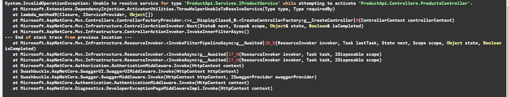

# Vaihe 3: Service-kerros, Repository, Result Pattern ja API-dokumentaatio — Teoriakysymykset

Vastaa alla oleviin kysymyksiin omin sanoin. Kirjoita vastauksesi kysymysten alle.

> **Vinkki:** Jos jokin kysymys tuntuu vaikealta, palaa lukemaan teoriamateriaalit:
> - [Service-kerros ja DI](https://github.com/xamk-mire/Xamk-wiki/blob/main/C%23/fin/04-Advanced/WebAPI/Services-and-DI.md)
> - [Repository Pattern](https://github.com/xamk-mire/Xamk-wiki/blob/main/C%23/fin/04-Advanced/Patterns/Repository-Pattern.md)
> - [Result Pattern](https://github.com/xamk-mire/Xamk-wiki/blob/main/C%23/fin/04-Advanced/Patterns/Result-Pattern.md)

---

## Osa 1: Service-kerros

### Kysymys 1: Fat Controller -ongelma

Miksi on ongelma jos controller sisältää kaiken logiikan (tietokantakyselyt, muunnokset, validoinnin)? Anna vähintään kaksi konkreettista haittaa.

**Vastaus:**
Controllerista tulee satoja rivejä pitkä, sama logiikka toistuu, testaaminen on vaikeaa ja yhden asian muokkaaminen hyvin todennäköisesti rikkoo muita.

---

### Kysymys 2: Vastuunjako

Miten vastuut jakautuvat controller:n, service:n ja repository:n välillä tässä harjoituksessa? Kirjoita lyhyt kuvaus kunkin kerroksen tehtävästä.

**Controller vastaa:**
Mitä HTTP-pyynnöllä haluttiin tehdä.
**Service vastaa:**
Sovelluksen liiketoimintalogiikasta.
**Repository vastaa:**
Miten data haettiin.

---

### Kysymys 3: DTO-muunnokset servicessä

Miksi DTO ↔ Entity -muunnokset kuuluvat serviceen eikä controlleriin? Mitä hyötyä siitä on, että controller ei tunne `Product`-entiteettiä lainkaan?

**Vastaus:**
1. Controller ei tarvitse tietää entiteettejä 2. Service tietää miten DTO muunnetaan entiteetiksi ja miten entiteetti muunnetaan vastaukseksi. 3. Yksikkötesteissä voidaan testata koko ketju ilman controlleria 4. Jos entiteetin rakenne muuttuu, vain service ja mapping päivitetään eli controlleriin ei tarvitse koskea.

---

## Osa 2: Interface ja Dependency Injection

### Kysymys 4: Interface vs. konkreettinen luokka

Miksi controller injektoi `IProductService`-interfacen eikä suoraan `ProductService`-luokkaa? Mitä hyötyä tästä on?

**Vastaus:**
Controller tietää vain mitä tehdä, mutta ei miten. Tällöin voidaana mockata ja toteutusta voidaan muokata koskematta controlleriin.

---

### Kysymys 5: DI-elinkaaret

Selitä ero näiden kolmen elinkaaren välillä ja anna esimerkki milloin kutakin käytetään:

- **AddScoped:**
Kerran per HTTP-pyyntö. Käytetään tietokantapalveluissa.
- **AddSingleton:**
Kerran koko sovelluksen elinaikana. Käytetään konfiguraatiossa, välimuistissa tai HttpClient-tehtaissa.
- **AddTransient:**
Joka kerran, kun pyydetään. Käytetään kevyeissä palveluissa.

Miksi `AddScoped` on oikea valinta `ProductService`:lle?

AddScopella samaa tietokantaa käytetään, jokaisella pyynnöllä. Signletonilla hävittettyä DbContextia koitettaisiin käyttää seuraavissa pyynnöissä (ei toimi). Transientilla jokainen injektio loisi uuden instanssin.

---

### Kysymys 6: DI-kontti

Selitä omin sanoin mitä DI-kontti tekee kun HTTP-pyyntö saapuu ja `ProductsController` tarvitsee `IProductService`:ä. Mitä tapahtuu vaihe vaiheelta?

**Vastaus:**
DI-kontti ketjuttaa eri luokkien pyyntöjä tarvittavista palveluista. 1. DI-kontti huomaa ProductsControllerin konstruktorin pyytävän IProductService:ä. 2. DI-kontti katsoo rekisteröinnin: IProductService → ProductService. 3. DI-kontti luo ProductService:n riippuvuuksineen. 4. ProductsController saa valmiin IProductServicen.

---

### Kysymys 7: Rekisteröinnin unohtaminen

Mitä tapahtuu jos unohdat rekisteröidä `IProductService`:n `Program.cs`:ssä? Milloin virhe ilmenee ja miltä se näyttää?

**Vastaus:**
Koittaessasi laittaa järjestelmään HTTP-pyyntöä se menee rikki. Virhe näyttää tältä: 

---

## Osa 3: Repository-kerros

### Kysymys 8: Miksi repository?

`ProductService` käytti aluksi `AppDbContext`:ia suoraan. Miksi se refaktoroitiin käyttämään `IProductRepository`:a? Anna vähintään kaksi syytä.

**Vastaus:**
Tight coupling, ei testattavissa ja tietokantakyselyt sekoittuvat logiikkaan.

---

### Kysymys 9: Service vs. Repository

Mikä on `IProductService`:n ja `IProductRepository`:n välinen ero? Mitä tietotyyppejä kumpikin käsittelee (DTO vai Entity)?

**IProductService:**
Käsittelee vain DTO:oita. Hoitaa DTO <-> Entity -muunnosta ja liiketoimintalogiikkaa.

**IProductRepository:**
Käsittelee vain entiteettejä. Hoitaa vain tietokannan käsittelyn.

---

### Kysymys 10: Controllerin muuttumattomuus

Kun Vaihe 7:ssä lisättiin repository-kerros, `ProductsController` ei muuttunut lainkaan. Miksi? Mitä tämä kertoo rajapintojen (interface) hyödystä?

**Vastaus:**
ProductsController ei muuttunut lainkaan, koska se käyttää IProductService. Rajapintojen hyödyistä tämä kertoo sen, että sisäinen toteutus voi muuttua ilman kutsujan muokkaamista.

---

## Osa 4: Exception-käsittely ja lokitus

### Kysymys 11: ILogger

Mikä on `ILogger` ja miksi sitä tarvitaan? Mistä lokit näkee kehitysympäristössä?

**Vastaus:**
ILogger on ASP.NET Coren sisäänrakennettu rajapinta, joka kirjoittaa viestejä (lokittaa) sovelluksen lokiin tietoja mitä tapahtui ja milloin. Kehitysympäristössä ne näkee konsolista.

---

### Kysymys 12: Odotetut vs. odottamattomat virheet

Selitä ero "odotetun" ja "odottamattoman" virheen välillä. Anna esimerkki kummastakin ja kerro miten ne käsitellään eri tavalla servicessä.

**Odotettu virhe (esimerkki + käsittely):**
Logiikka ei vastaa toteutusta. Esim. Hinta asetetaan negatiiviseksi. Servicessä palautetaan null, false tai Result.

**Odottamaton virhe (esimerkki + käsittely):**
Asia, johon ei ohjelma voi vaikuttaa. Esim. Tietokanta alhaalla. Servicessä _logger.LogError + throw.

---

## Osa 5: Result Pattern

### Kysymys 13: Miksi null ja bool eivät riitä?

Alla on kaksi esimerkkiä. Selitä miksi ensimmäinen tapa on ongelmallinen ja miten toinen ratkaisee ongelman:

```csharp
// Tapa 1: null
ProductResponse? product = await _service.GetByIdAsync(id);
if (product == null)
    return NotFound();

// Tapa 2: Result
Result<ProductResponse> result = await _service.GetByIdAsync(id);
if (result.IsFailure)
    return NotFound(new { error = result.Error });
```

**Vastaus:**
Ensimmäinen on ongelmallinen, koska null voi tarkoittaa montaa eri asiaa. (esim. tietokanta-, validointi- tai oikeusvirhe). Toisessa palautetaan Result -olio, joka kertoo tarkalleen onnistuiko operaatio ja mikä meni väärin.

---

### Kysymys 14: Result.Success vs. Result.Failure

Miten `Result Pattern` muutti virheiden käsittelyä servicessä? Vertaa Vaihe 8:n `throw;`-tapaa Vaihe 9:n `Result.Failure`-tapaan: mitä eroa niillä on asiakkaan (API:n kutsuja) näkökulmasta?

**Vastaus:**
'Result Pattern':n avulla service pystyy käsittelemään tietyn syyn operaation epäonnistumiseen. Asiakkaan näkökulmassa myös kerrotaan miksi operaatio epäonnistui, eikä vain lokiteta konsoliin.

---

## Osa 6: API-dokumentaatio

### Kysymys 15: IActionResult vs. ActionResult\<T\>

Miksi `ActionResult<ProductResponse>` on parempi kuin `IActionResult`? Anna vähintään kaksi syytä.

**Vastaus:**
`ActionResult<ProductResponse>`:n avulla Swagger pystyy generoimaan response-scheman, kääntäjä tietää palautustyypin, attribuutit dokumentoivat kaikki statuskoodit ja kääntäjä varoittaa jos palautustyyppi ei täsmää.

---

### Kysymys 16: ProducesResponseType

Mitä `[ProducesResponseType]`-attribuutti tekee? Miten se näkyy Swagger UI:ssa?

**Vastaus:**
`[ProducesResponseType]`-attribuutti kertoo kaikki endpointin mahdolliset statuskoodit. SwaggerUI:ssa sen näkee HTTP-pyynnön pohjalla.

---

### Kysymys 18: Refaktorointi

Sovelluksen toiminnallisuus pysyi täysin samana koko harjoituksen ajan — samat endpointit, samat vastaukset. Mitä refaktorointi tarkoittaa ja miksi se kannattaa, vaikka käyttäjä ei huomaa eroa?

**Vastaus:**
Refaktarointi tarkoittaa rakenteen päivittämistä. Se kannattaa vaikka käyttäjä ei huomaa eroa, koska koodista tulee ymmärrättevämpää ja ylläpidettävämpää.

---
